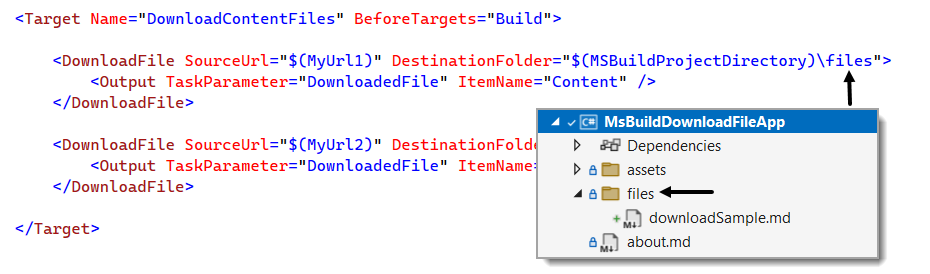

## DownloadFile task

Downloads the specified files using the Hyper-Text Transfer Protocol (HTTP).

## Example 1

In this example the file `downloadSample.md` and `about.md` is downloaded and added to this project base folder using the following in the project file.

:open_book: [Microsoft documentatiom](https://learn.microsoft.com/en-us/visualstudio/msbuild/downloadfile-task?view=vs-2022)


## Example 2

Suppose the file should be in a folder below the project base folder, append a backslash and folder name as per below.



## Output window

Will show the task downloading the files which can be helpful if the download file task fails.

```
1>Downloading from "https://raw.githubusercontent.com/karenpayneoregon/ms-build-examples/master/downloadSample.md" to "C:\DotnetLand\ms-build-examples\MsBuildDownloadFileApp\files\downloadSample.md" (210 bytes).
1>Downloading from "https://raw.githubusercontent.com/karenpayneoregon/ms-build-examples/master/about.md" to "C:\DotnetLand\ms-build-examples\MsBuildDownloadFileApp\about.md" (33 bytes).
```

On failure, in this case the file extension was left off.

```
1>C:\DotnetLand\ms-build-examples\MsBuildDownloadFileApp\MsBuildDownloadFileApp.csproj(24,4): error MSB3923: Failed to download file "https://raw.githubusercontent.com/karenpayneoregon/ms-build-examples/master/about".  Response status code does not indicate success: 404 (Not Found).
```