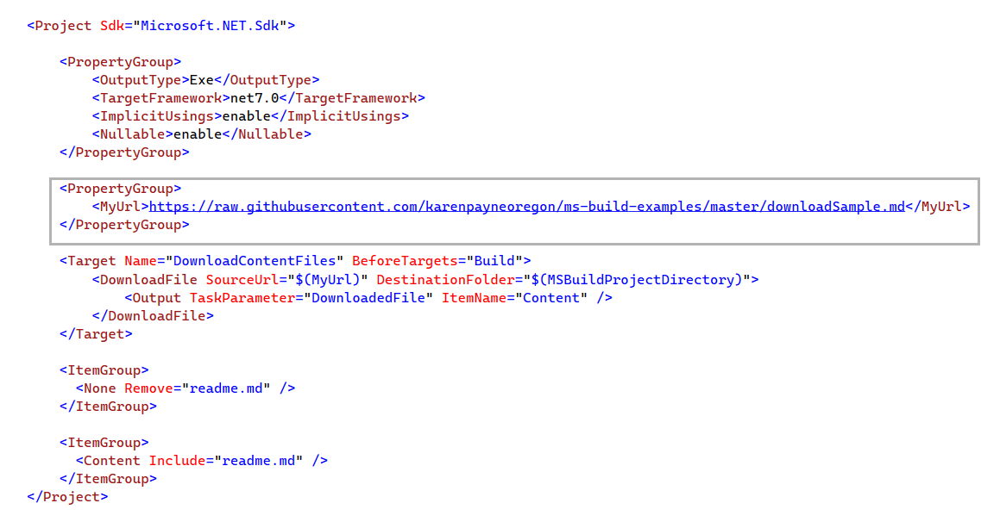

## DownloadFile task

Downloads the specified files using the Hyper-Text Transfer Protocol (HTTP).

In this example the file `downloadSample.md` is downloaded and added to this project using the following in the project file.

:open_book: [Microsoft documentatiom](https://learn.microsoft.com/en-us/visualstudio/msbuild/downloadfile-task?view=vs-2022)

