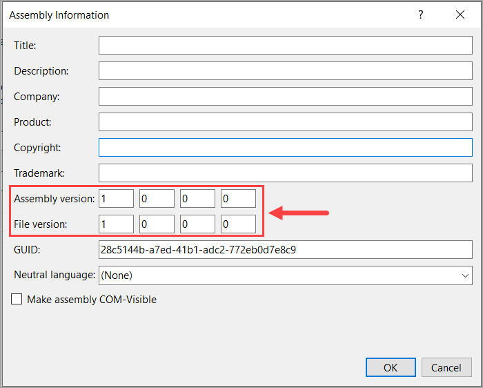
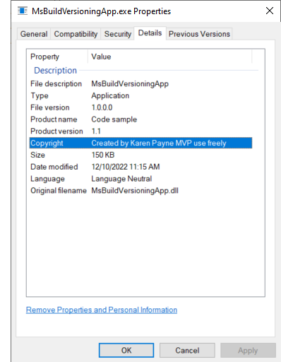

# Using Directory.Build.props for versioning

To set an appliction's version for .NET Framework 4.8 and earlier, this is done under project properties as per below.



For .NET Framework Core this can be done under Properties, Package, General. Another option is to create `Directory.Build.props` as per below.

```xml
<Project>
    <PropertyGroup>
        <Version>1.1</Version>
        <FileVersion>1.0.0.0</FileVersion>
    </PropertyGroup>
</Project>
```




# See also

- Microsoft docs: [Directory.Build.props and Directory.Build.targets](https://learn.microsoft.com/en-us/visualstudio/msbuild/customize-your-build?view=vs-2022#directorybuildprops-and-directorybuildtargets)
- [Under the hood](https://github.com/dotnet/sdk/blob/94a3f2856cb09e66ee7472820b4e26fb576b4686/src/Tasks/Microsoft.NET.Build.Tasks/build/Microsoft.NET.GenerateAssemblyInfo.targets) (Microsoft source code)