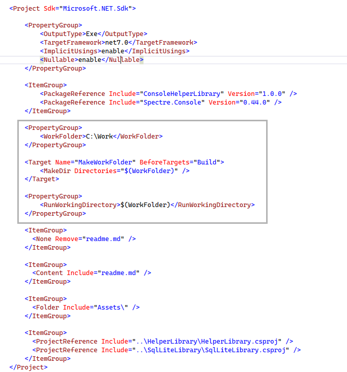

# How to set application working folder in project file

Many applications use their executable folder for creating and accessing various forms of files while an alternative is to use a folder devoid of the folder where the executable resides or any sub folder, this project show how to create a working folder using MS-Build task.

- First decide on the folder to perform work e.g. read/write to files or open a database
- Next create a variable in a `PropertyGroup` as shown below `WorkingFolder` as we need it in to places
- Create a `Target` for creating the folder indicated above before the build process takes place which uses [MakeDir](https://learn.microsoft.com/en-us/visualstudio/msbuild/makedir-task?view=vs-2022) task to create the folder
- Create a `PropertyGroup` to set the working forlder using [RunWorkingDirectory](https://learn.microsoft.com/en-us/dotnet/core/project-sdk/msbuild-props#runworkingdirectory). The RunWorkingDirectory property defines the working directory for the application process to be started in. It can be an absolute path or a path that's relative to the project directory. If you don't specify a directory, OutDir is used as the working directory.

> **Note**
> Any time something is needed more than once always create a variable as done in the second bullet above as there is always the chance of a misspelling which leads to undesirable results.

## Examples

:small_orange_diamond: Create a file in the working folder

:small_orange_diamond: Create a SqlLite database in the working folder, populate and view via EF Core.

